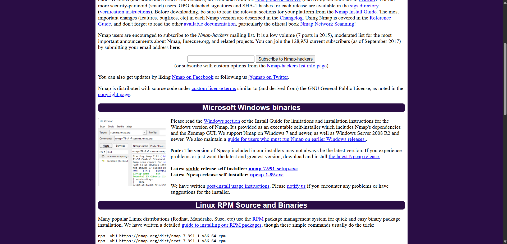
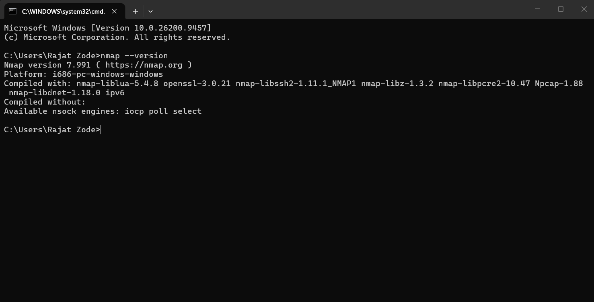
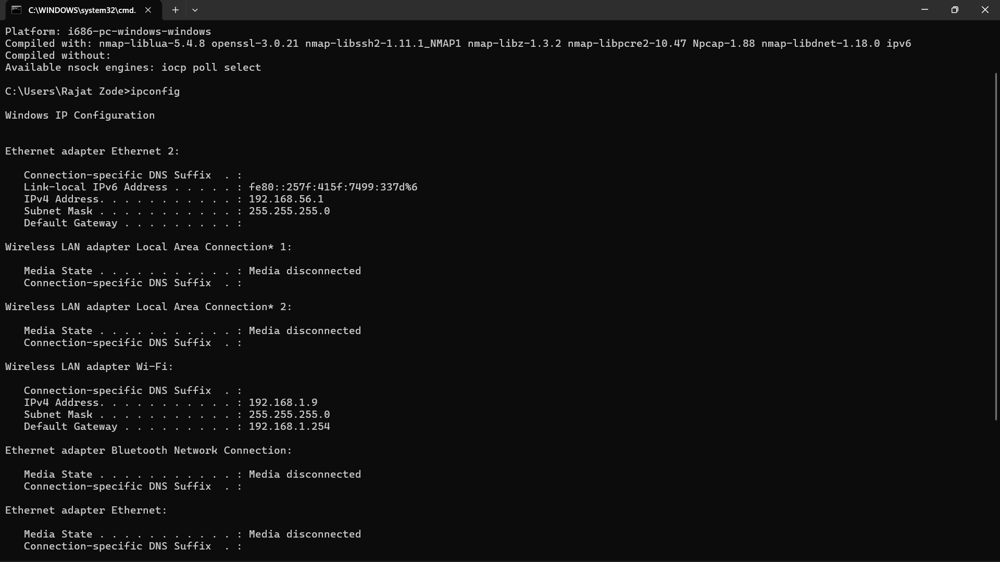
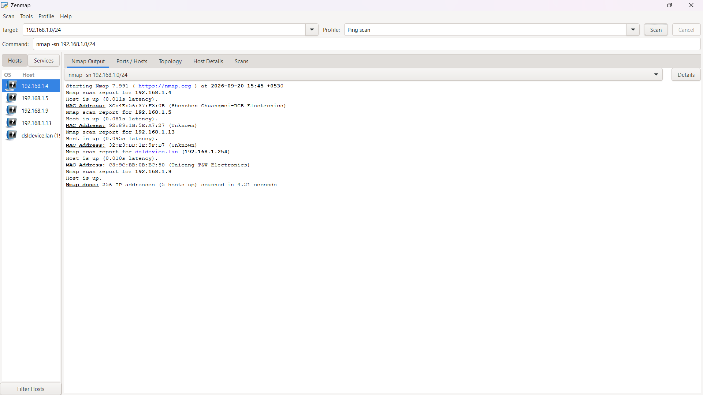
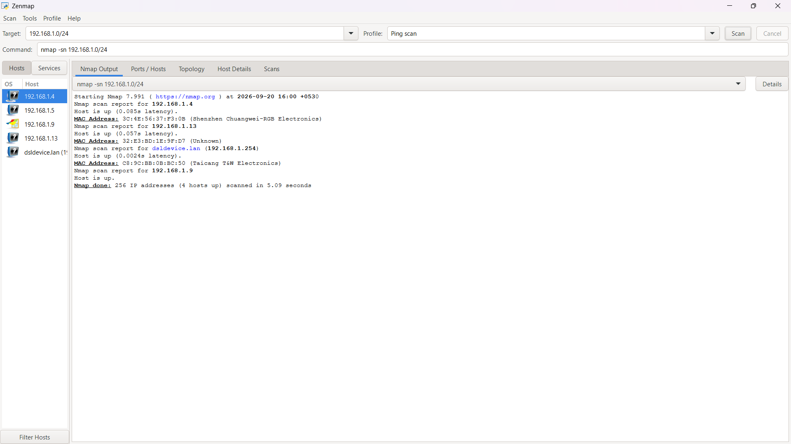
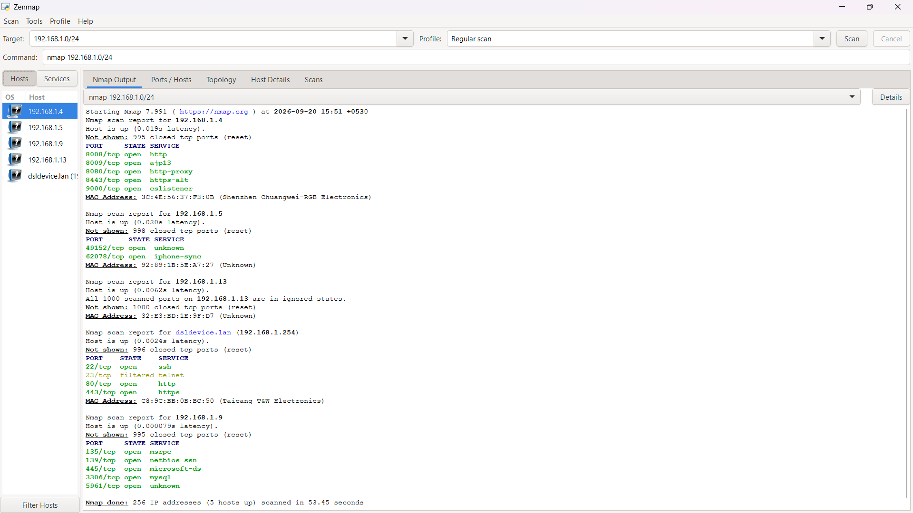
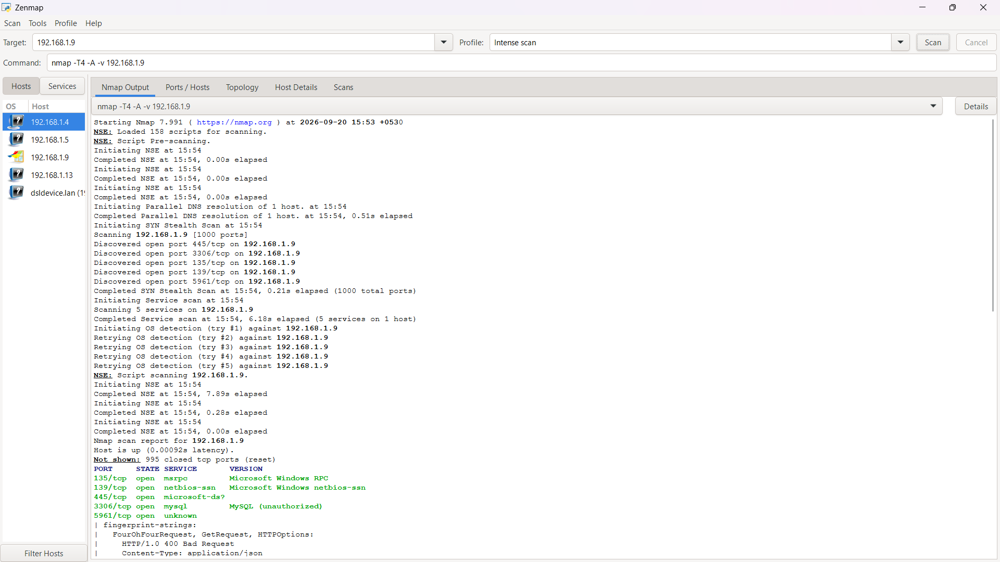
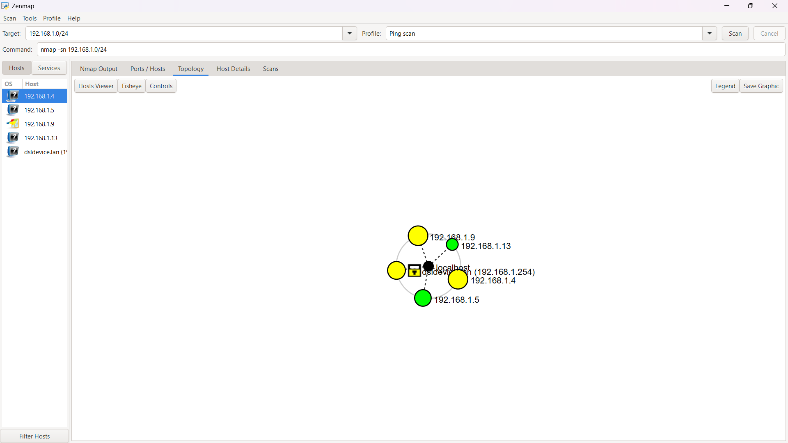
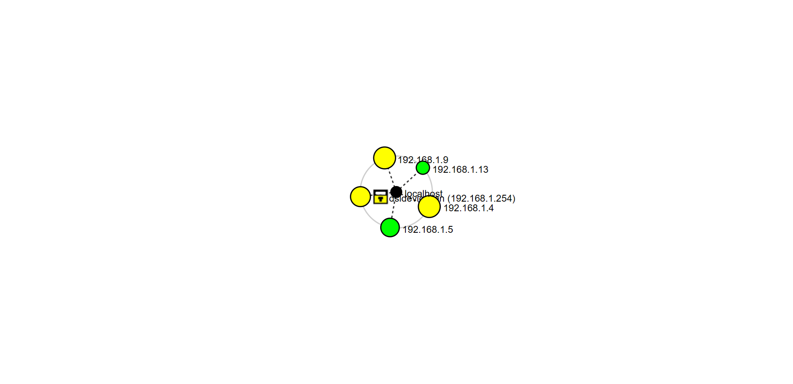

# Networkwalks — Week 2 Internship

## Cybersecurity Internship — Week 2

This repository contains my completed **Week 2 internship work at Networkwalks**.

The work includes two modules:

* **Module 5 — Network Scanning with Zenmap**
* **Module 1 — Footprinting & Reconnaissance with Multiple Kali Linux Tools**

---

# Module 5 — Network Scanning with Zenmap

## Objective

The objective of this module was to perform network discovery and scanning using **Zenmap/Nmap**, identify live hosts on the local network, collect their IP and MAC addresses, identify services, and generate a network topology.

---

## Task 1 — Download & Install Zenmap

Zenmap/Nmap was downloaded and installed successfully as part of the network scanning lab setup.

### Screenshot 01 — Nmap Download



### Screenshot 02 — Nmap Installation



---

## Task 2 — Find Local IP Address & LAN Subnet

The local network configuration was checked to identify the local IP address, subnet mask, default gateway, and LAN subnet.

### Results

| Parameter            | Value            |
| -------------------- | ---------------- |
| **Local IP Address** | `192.168.1.9`    |
| **Subnet Mask**      | `255.255.255.0`  |
| **LAN Subnet**       | `192.168.1.0/24` |
| **Default Gateway**  | `192.168.1.254`  |

### Screenshot 03 — IP Configuration



---

## Task 3 — Find Live Hosts

A **Zenmap Ping Scan** was performed against the local subnet:

```text
192.168.1.0/24
```

The Ping Scan was used to identify the live hosts available on the local network.

## Screenshot 04


## Task 4 — Number of Live Hosts

The network scan identified 5 live hosts in the subnet.

Result
5 live hosts

## Task 5 — IP Addresses of Live Hosts

The live hosts identified during the scan were:

192.168.1.4
192.168.1.5
192.168.1.9
192.168.1.13
192.168.1.254



## Task 6 — MAC Addresses of Live Hosts

The MAC addresses of the discovered live hosts were identified from the Zenmap scan results and network configuration information.

Additional Network Scan

An additional Regular Scan was performed to observe detected ports and services.



An Intense Scan was also performed to obtain additional service and version information.



## Task 7 — Network Topology

Zenmap's Topology view was used to visualize the discovered hosts and network relationships.






Module 1 — Footprinting & Reconnaissance
Objective

The objective of this module was to perform footprinting and reconnaissance using multiple tools available in Kali Linux.

The target domain used for the lab was:

networkwalks.com
Tools Used
WHOIS
WhatWeb
NSLookup
cURL
WAFW00F
DNSRecon
Task 1 — WHOIS
Command
whois networkwalks.com
Purpose

WHOIS was used to retrieve publicly available domain registration information, including registrar information, registration dates and name servers.

Key Results
Domain: NETWORKWALKS.COM
Registrar: GoDaddy.com, LLC
Creation Date: 2019-11-06
Expiry Date: 2027-11-06
Name Server: NS6135.HOSTGATOR.COM
Name Server: NS6136.HOSTGATOR.COM
Screenshot 10

Task 2 — WhatWeb
Command
whatweb networkwalks.com
Purpose

WhatWeb was used to identify technologies and services associated with the target website.

Observed Information
Web Server: Apache
IP Address: 192.232.216.135
CMS: WordPress
WordPress Download Manager: 3.3.58
jQuery: 3.7.1
Bootstrap: 7.1.1
Google Tag Manager
HTML5
Website Title: Networkwalks Academy
Screenshot 11

Task 3 — NSLookup
Command
nslookup networkwalks.com
Purpose

NSLookup was used to resolve the domain name and identify its corresponding IP address.

Results
DNS Server: 1.1.1.1
Resolved IP Address: 192.232.216.135
Screenshot 12

Task 4 — HTTP Response Headers
Command
curl -I https://networkwalks.com
Purpose

cURL was used to retrieve and inspect the HTTP response headers returned by the target website.

Observed Information

The response returned:

HTTP/2 200

The response headers included information such as:

Server: Apache
Content-Type: text/html; charset=UTF-8
WordPress-related headers
Cache-related headers
Cookie information
WordPress REST API information
Referrer policy
Permissions policy
Screenshot 13

Task 5 — Web Application Firewall Detection
Command
wafw00f networkwalks.com
Purpose

WAFW00F was used to identify whether a Web Application Firewall was protecting the target website.

Result

The tool reported:

The site https://networkwalks.com is behind ModSecurity (SpiderLabs) WAF.
Screenshot 14

Task 6 — DNS Enumeration
Command
dnsrecon -d networkwalks.com
Purpose

DNSRecon was used to enumerate publicly available DNS information for the target domain.

Records Observed

The enumeration identified:

SOA records
NS records
MX records
A records
TXT/SPF records
SRV records

The tool reported:

8 Records Found

The enumeration completed successfully.

Screenshot 15

Tools Used
Module 5
Zenmap
Nmap
Module 1
Kali Linux
WHOIS
WhatWeb
NSLookup
cURL
WAFW00F
DNSRecon
Skills Practiced

Through these modules, I practiced:

Network discovery
Host identification
IP address identification
MAC address identification
Network topology visualization
Port and service enumeration
Domain footprinting
Web technology fingerprinting
DNS enumeration
HTTP header analysis
WAF detection
Reconnaissance techniques
Kali Linux command-line tools
Evidence

All screenshots are organized in their respective module folders.

Module 5

Screenshots 01–09

Module 1

Screenshots 10–15

The screenshot numbering is continuous across both modules because both modules are being submitted together as the Week 2 internship project.

Week 2 Completion
 Module 5 — Network Scanning with Zenmap
 Module 1 — Footprinting & Reconnaissance
 Module 2 — Not included in this submission
Internship

Networkwalks — Cybersecurity Internship

Week 2 Project Completed

This project demonstrates practical experience with network scanning, reconnaissance, DNS enumeration, web technology fingerprinting, HTTP analysis and WAF detection using Kali Linux.
